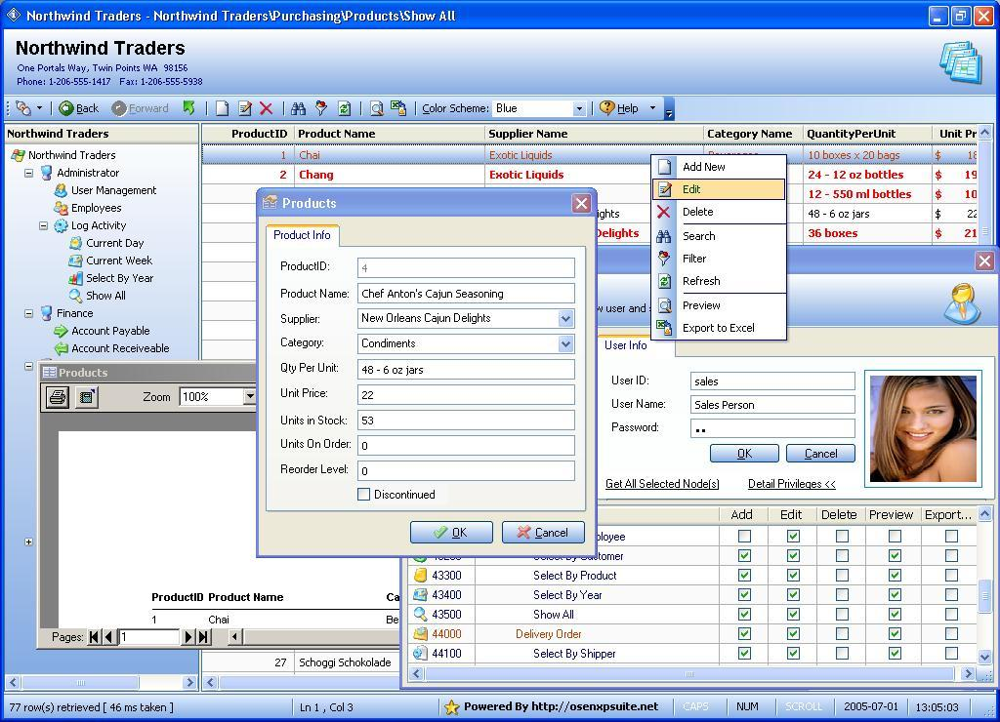



## Northwind Database with Enterprise Manager

### Description

Sample database application using TreeView as navigation menu, and listview for display the resultset. Full user privileges access, you can manage user privileges very easy.

With this sample, you can build database application more quickly and advantage.
 
### More Info
 

             |
---                |---
**Submitted On**   |2005-06-29 13:23:16
**By**             |[devilito](https://github.com/Planet-Source-Code/PSCIndex/blob/master/ByAuthor/devilito.md)
**Level**          |Advanced
**User Rating**    |3.4 (17 globes from 5 users)
**Compatibility**  |VB 5\.0, VB 6\.0
**Category**       |[Complete Applications](https://github.com/Planet-Source-Code/PSCIndex/blob/master/ByCategory/complete-applications__1-27.md)
**World**          |[Visual Basic](https://github.com/Planet-Source-Code/PSCIndex/blob/master/ByWorld/visual-basic.md)
**Archive File**   |[Northwind\_190773712005\.zip](https://github.com/Planet-Source-Code/devilito-northwind-database-with-enterprise-manager__1-61440/archive/master.zip)

